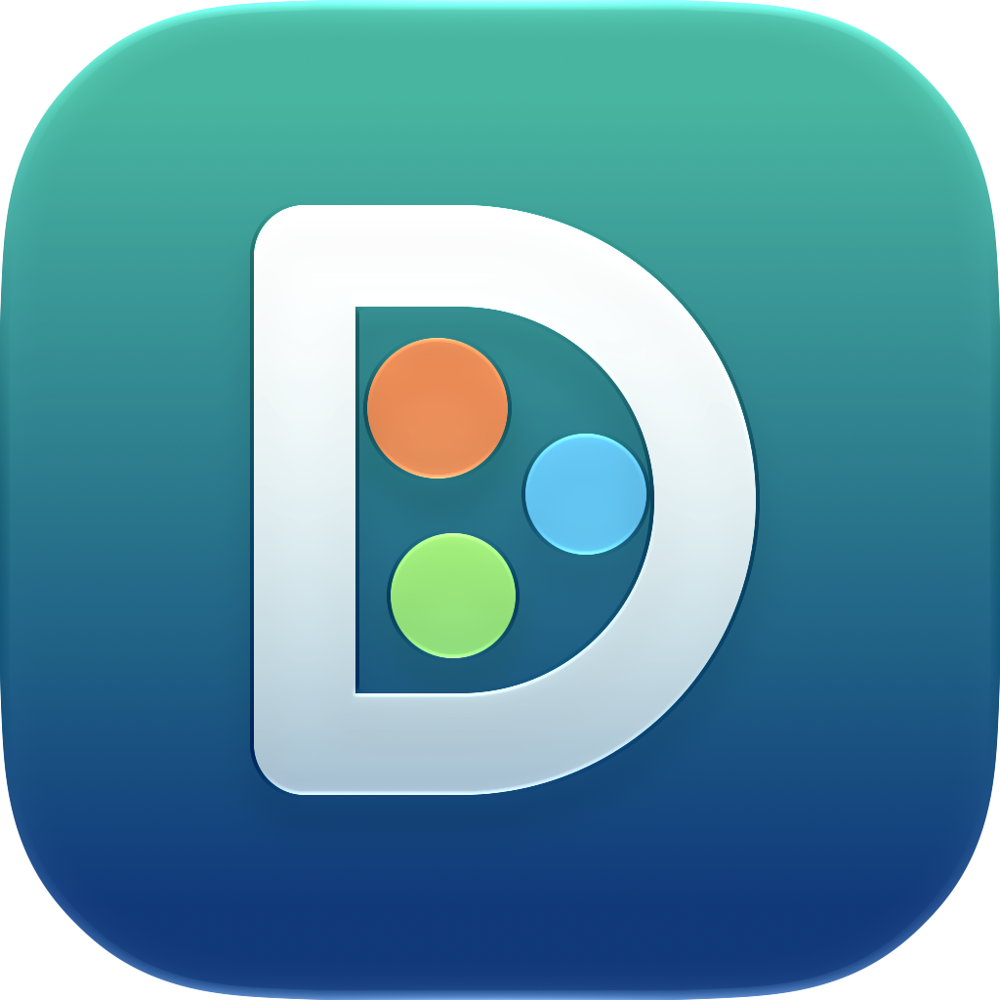

# Drover

[English](README.md) · **Русский**

Десктопное приложение для [herdr](https://herdr.dev) в стиле Claude Code / Codex desktop: агенты живут в herdr, а вы общаетесь с ними в нормальном чате — со вставкой скриншотов, историей, статусами и лимитами. Терминал не нужен, но всегда под рукой.

*Drover* — погонщик: тот, кто перегоняет стадо к цели. herdr держит «стадо» агентов, Drover ведёт его к задаче. На иконке — буква D, внутри которой три агента.

## Возможности

- **Чат вместо терминала.** Переписка Claude Code и Codex строится из их собственных файлов сессий: markdown, код с подсветкой, сгруппированные вызовы инструментов («Ran 5 commands, edited 2 files»), диффы правок, план/todo, «Worked for 2m 31s».
- **Скриншоты.** ⌘V в поле ввода, перетаскивание файлов или скрепка. Картинка сохраняется в `~/.drover/attachments/` и передаётся агенту как вложение (`[Image #1]` в Claude Code и Codex). Фото HEIC/TIFF автоматически конвертируются в JPEG.
- **Все агенты herdr.** Сайдбар: проекты (workspaces) → вкладки → агенты со статусами *Working / Needs input / Done*. Сортировка «по вниманию», поиск ⌘K.
- **Новый агент** (⌘N): проект или папка, Claude Code / Codex / любой агент herdr / просто терминал, новая вкладка или сплит, отдельный git worktree, аргументы запуска, первое сообщение.
- **Модель для каждого агента.** Модель и глубину рассуждений можно выбрать при запуске (новый агент, команда, роли — `model:`/`effort:` в файле роли) и сменить потом прямо из чата: чип модели под полем ввода открывает меню. Drover переключает модель через собственное меню `/model` агента в режиме «только для этой сессии», поэтому модели по умолчанию в Claude Code и Codex не меняются. Список моделей Codex берётся из его локального кэша.
- **Роли.** В окне «Новый агент» можно выбрать роль (оркестратор, фронтенд, бэкенд, ревьюер, QA или свою) — агент сразу получает её инструкции первым сообщением. Приложение дожидается, пока агент действительно готов принимать ввод, и проверяет, что сообщение принято; если при запуске агент спросил что-то (например, доверие к папке), инструкции уйдут, как только вы ответите. Роли проекта берутся из файлов `.ai/roles/*.md` или `.herdr/roles/*.md`, свои роли и правки — в Настройки → Роли.
- **Команда одной кнопкой** (правый клик по проекту → «Запустить команду…»): каждый агент открывается в своей вкладке со своей ролью, оркестратор стартует последним и получает список команды и подсказку, как раздавать задачи (`herdr agent prompt <имя> …`).
- **Доска задач** для каждого проекта (строка «Задачи» под проектом в сайдбаре). Оркестратор ведёт задачи команды в `.drover/tasks.json` — кто что делает и в каком статусе: ожидает, в работе, на проверке, готово или застряла, — а Drover показывает их колонками рядом с тем, чем прямо сейчас занят каждый агент (его последний запрос и собственный план). Задачи можно добавлять прямо на доске: они уходят оркестратору, а он раскладывает их и раздаёт параллельно. Папку `.drover/` Drover прячет из git через `.git/info/exclude`.
- **Хватает одного оркестратора** на любое число задач: он даёт каждому свободному агенту свою задачу параллельно (`herdr agent prompt … --wait` в фоне) и читает ответы по мере готовности.
- **Сообщение нескольким агентам** — одна рассылка выбранным агентам проекта.
- **Превью сайта** (⌘⇧P): справа открывается ваш локальный сайт (dev-серверы проекта находятся сами). Режим выбора (⌘⇧C) подсвечивает элементы под курсором; клик отправляет элемент в поле ввода — с селектором, React-компонентом и файлом исходника (если доступны), HTML, стилями и скриншотом элемента. Shift-клик — несколько элементов. Размеры экрана: full / 1280 / 768 / 390.
- **Агенты сами открывают превью:** `herdr pane report-metadata "$HERDR_PANE_ID" --source drover --token preview=<url>` — подсказка об этом добавляется в инструкции ролей (можно отключить в Настройки → Роли).
- **Когда агент ждёт ответа** (разрешение, вопрос) — янтарный баннер с кнопками `1 2 3 ↑ ↓ Enter Esc` и живой терминал снизу.
- **Терминал.** Панель ⌘J под чатом или полноэкранный режим (⌘⇧T) — настоящий терминал панели herdr (xterm.js, WebGL), с вводом, скроллом, вставкой картинок.
- **Лимиты** (только из локальных файлов, без токенов и запросов к API). Codex: окна из его файлов сессий. Claude Code: 5-часовое и недельное окна через строку статуса Claude Code (включается в настройках). Мини-блок в сайдбаре, подробности по клику, чип в поле ввода.
- **Уведомления** macOS, когда агент закончил или ждёт ответа, и бейдж на иконке в Dock.
- **Управление herdr:** переименование/закрытие агентов, вкладок, панелей и проектов, сплиты, zoom, перенос панели во вкладку, сессии herdr, запуск сервера, установка интеграций, плагины.
- **Языки:** English, Русский, Español, Deutsch, 中文 (Настройки → Основные → Язык; по умолчанию — язык системы).

### Оформление (Настройки → Оформление)

- 16 готовых тем: Light, Dark, Paper, Midnight, Dracula, Nord, Tokyo Night, Catppuccin Mocha/Latte, Rosé Pine, Gruvbox, One Dark, GitHub Light/Dark, Solarized Light/Dark — и «Как в системе». Тема перекрашивает и терминал.
- **Своя тема:** «Настроить эту тему…» делает копию текущей, в редакторе меняются 12 цветов, светлая/тёмная основа и название. Темы можно экспортировать в файл `.drover-theme.json` и импортировать.
- **Акцент** — 8 готовых цветов или любой.
- **Фон:** 9 градиентов, своя картинка (PNG, JPEG, WebP, GIF, HEIC…) или видео (MP4, WebM, MOV) — с настройкой затемнения, размытия и прозрачности панелей («стекло»), заполнение или вписывание. Файл копируется в данные приложения.
- Шрифты интерфейса и терминала, размеры шрифтов чата и терминала, скругление углов, плотность интерфейса.

## Установка

Нужен установленный [herdr](https://herdr.dev) (`curl -fsSL https://herdr.dev/install.sh | sh`) и агенты, которыми вы пользуетесь (`claude`, `codex`, …). Приложение собрано для macOS на Apple Silicon.

1. Скачайте `Drover-<версия>-arm64.dmg` из [Releases](https://github.com/mariotgb/drover/releases/latest) и перетащите Drover в «Программы».
2. Приложение не нотаризовано Apple, поэтому первый запуск macOS заблокирует. Откройте его один раз, затем зайдите в Системные настройки → Конфиденциальность и безопасность и нажмите **«Открыть всё равно»** (Open Anyway) (или выполните `xattr -dr com.apple.quarantine /Applications/Drover.app`).
3. Drover подключится к работающему серверу herdr или запустит его сам — агенты продолжают работать и после закрытия приложения. Чтобы herdr выключался вместе с Drover, включите Настройки → herdr → **Останавливать herdr при выходе из Drover** (если агенты ещё работают, Drover сначала спросит).

Для точного чата и статусов включите интеграции herdr (Настройки → Интеграции или `herdr integration install claude` / `codex`).

### Лимиты

Приложение никогда не использует ваши токены и не обращается к API Anthropic или OpenAI — лимиты читаются только с диска.

- **Codex** сам пишет снимок лимитов в каждый файл сессии (`~/.codex/sessions/…`), приложение берёт самый свежий.
- **Claude Code** получает лимиты в каждом своём ответе и официально передаёт их команде строки статуса (`statusLine`). Кнопка Настройки → Основные → Лимиты Claude Code → **Включить** подключает маленький локальный скрипт `~/.drover/claude-statusline.sh` в `~/.claude/settings.json` (копия файла сохраняется рядом, `settings.json.drover-backup`). Скрипт сохраняет то, что ему передал Claude Code, в `~/.drover/claude-status/` и выводит в строку статуса Claude «5h 42% · wk 6%». Если у вас уже была своя строка статуса, она продолжит работать. **Выключить** возвращает всё как было.

## Горячие клавиши

| | |
|---|---|
| ⌘N / ⌘⇧N | Новый агент / новый проект |
| ⌘T | Новая вкладка-терминал |
| ⌘K | Поиск тредов и команд |
| ⌘J | Панель терминала под чатом |
| ⌘⇧T | Чат ↔ терминал |
| ⌘⇧P | Превью сайта |
| ⌘⇧C | Выбрать элемент в превью |
| ⌘. | Остановить агента (Esc) |
| ⌘[ / ⌘] / ⌘1…9 | Переключение тредов |
| ⌘⇧] | Следующий агент, ждущий внимания |
| ⌘B | Сайдбар |

## Разработка

```bash
npm install
npm run dev        # запуск с hot reload
npm test           # тесты парсеров, лимитов, отправки, создания агентов и переводов
npm run typecheck
npm run dist       # сборка .app и .dmg в release/
```

Иконка — документ Icon Composer `resources/Drover.icon` (слои SVG + `icon.json`): macOS 26+ рисует её в стиле Liquid Glass и сам делает тёмную, тонированную и прозрачную версии. `npm run icon` пересоздаёт её из `scripts/make-icon.mjs`; документ можно открыть и подправить в Icon Composer. Если Xcode 26+ настроен (`sudo xcodebuild -runFirstLaunch`), `npm run dist` компилирует «живую» иконку Liquid Glass через `actool`; без него сборка берёт готовую `resources/icon.icns`.

Переменные для разработки: `DROVER_SESSION=<имя>` — работать с другой сессией herdr, `DROVER_USER_DATA=<папка>` — отдельный профиль, `DROVER_READONLY=1` — только просмотр (без ввода, фокуса и ресайза; терминалы в режиме observe), `DROVER_BACKGROUND=1` — окно не забирает фокус (для автотестов).

### Как устроено

- `src/main/herdr/` — клиент сокет-API herdr (NDJSON по `~/.config/herdr/herdr.sock`), подписки на события, снапшоты, автозапуск сервера.
- `src/main/terminal.ts` — каждый открытый терминал = процесс `herdr terminal session control <pane>`: сервер рендерит кадры под наш размер, ввод/resize/scroll идут JSON-командами.
- `src/main/transcripts/` — поиск и инкрементальный разбор сессий Claude Code (`~/.claude/projects/…/<id>.jsonl`) и Codex (`~/.codex/sessions/…/rollout-…jsonl`). id сессии приходит от интеграций herdr; если его нет — сопоставление по времени старта процесса и cwd.
- `src/main/actions.ts` — отправка сообщений: каждый скриншот вставляется как bracketed paste пути, затем текст через `agent.prompt`. Создание агента: `agent.start`, ожидание `interactive_ready` через `agent.get`, затем первое сообщение с подтверждением (`agent.prompt` + `wait`).
- `src/main/tasks.ts` — доска задач: читает `.drover/tasks.json` снисходительно (комментарии, лишние запятые, синонимы статусов), опрашивает файл и правит его на месте, сохраняя собственные поля оркестратора.
- `src/main/models.ts` — каталог моделей и смена модели у запущенного агента: Drover читает экран панели, проходит по меню `/model` агента и подтверждает клавишей «только для этой сессии» (Enter там сохранил бы новую модель по умолчанию).
- `src/main/preview.ts` — поиск dev-серверов (`lsof` + cwd процесса) и скриншот выбранного элемента; `src/renderer/src/preview/` — панель превью (`<webview>`) и скрипт выбора элементов.
- `src/main/roles.ts`, `src/renderer/src/roles.ts` — роли проекта и встроенные роли, инструкции команды.
- `src/shared/themes.ts`, `src/renderer/src/appearance.ts` — темы (вся палитра интерфейса и терминала выводится из 12 цветов), фоны; файлы фонов отдаются через протокол `hdfile://` с поддержкой Range для видео.
- `src/renderer/src/i18n/` — переводы (ключи — английские строки), `src/main/i18n.ts` — меню и уведомления.
- `src/main/limits.ts` — лимиты Claude Code и Codex.
- `src/renderer/` — React-интерфейс.

Окружение login-shell резолвится при старте, поэтому приложение из Dock находит `herdr`, `claude` и `codex`, а сервер herdr, запущенный приложением, получает ваш обычный `PATH`.

## Ограничения

- Чат-вид — для Claude Code и Codex; остальные агенты показываются как терминал.
- Компонент и файл исходника в превью определяются для React в dev-режиме; для остальных фреймворков передаются селектор, HTML, стили и скриншот.
- Панели одной вкладки показываются как отдельные треды, а не сеткой; перетаскивание вкладок/проектов для сортировки пока не сделано.
- Удалённые машины herdr (`--remote`, `machine`) не поддерживаются.

## Лицензия

[MIT](LICENSE)
